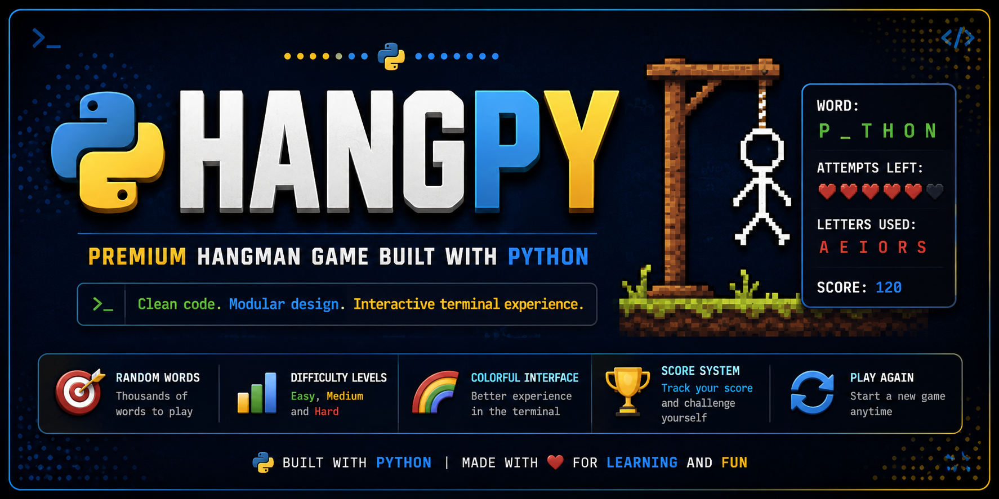
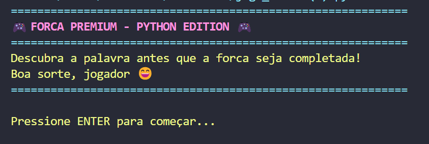
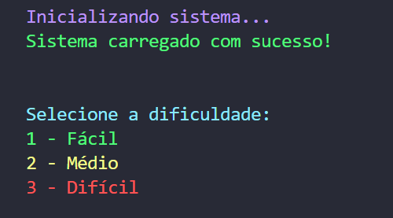
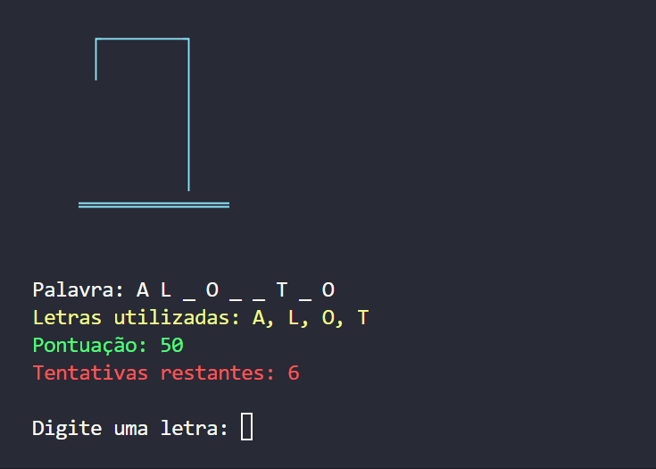
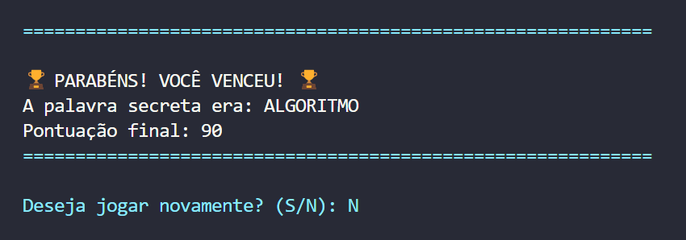
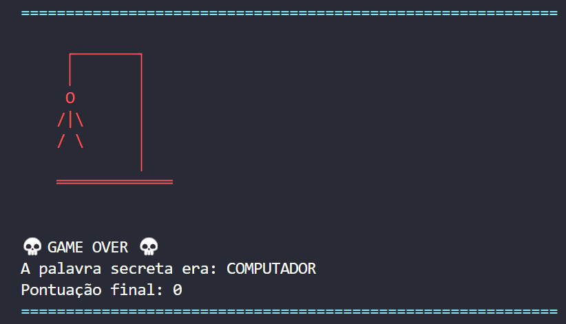

<p align="center">
  
</p>

# 🎮 HangPy

> A modern Hangman game built with Python.

HangPy is an interactive Hangman game developed in Python with a focus on clean code, modular programming and an enjoyable terminal experience.

---

## 🚀 Features

- 🎯 Random word selection
- 🎮 Difficulty levels
- 🌈 Colored interface
- 🏆 Score system
- 🔁 Play again option
- 🧩 Modular code
- 📦 Clean project structure

---

## 🛠 Technologies

- Python 3
- Colorama

---

## 📁 Project Structure

```text
hangpy/
├── assets/
│   └── screenshots/
│       ├── home-screen.png
│       ├── difficulty-menu.png
│       ├── gameplay.png
│       ├── victory.png
│       └── game-over.png
├── jogo_forca.py
├── requirements.txt
├── LICENSE
└── README.md
```

---

## ▶️ Running locally

Install the dependency:

```bash
pip install -r requirements.txt
```

Run the game:

```bash
python jogo_forca.py
```

---

## 📸 Preview

### 🏠 Home Screen



---

### 🎯 Difficulty Menu



---

### 🎮 Gameplay



---

### 🏆 Victory



---

### 💀 Game Over



---

## 📄 License

This project is licensed under the MIT License.
